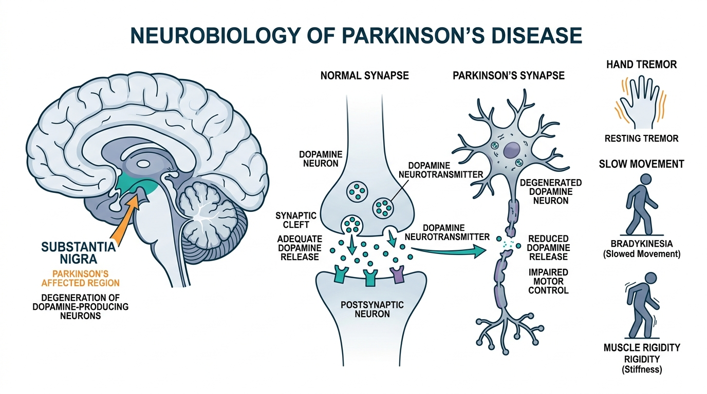

# Quantum Machine Learning-Based Parkinson's Disease Prediction

[](https://fastapi.tiangolo.com)
[](https://pennylane.ai/)
[](https://pytorch.org/)
[](https://opensource.org/licenses/MIT)

A publication-grade comparative research platform evaluating **Centralized**, **Federated**, and **Variational Quantum Neural Network (QNN / VQC)** architectures for motor UPDRS severity stratification on the Oxford Telemonitoring cohort under strict zero subject-leakage constraints.

**Institution:** B V Raju Institute of Technology

---

## 🩺 Clinical Overview & Neurobiology

Parkinson's disease is a progressive neurodegenerative disorder primarily characterized by the loss of dopaminergic neurons in the **substantia nigra pars compacta**, resulting in reduced dopamine transmission in the basal ganglia. This depletion impairs voluntary motor coordination, producing hallmark clinical manifestations:

- **Motor Symptoms:** Resting tremor, bradykinesia (slowness of movement), muscle rigidity, and postural instability.
- **Non-Motor Symptoms:** Dysphonia (vocal micro-perturbations), sleep disturbances, sensory and cognitive changes.
- **Clinical Telemonitoring:** Early dysphonia can be evaluated non-invasively through sustained vowel phonations, enabling automated remote severity stratification into mild (motor UPDRS $\le$ threshold) versus moderate-to-severe impairment.



---

## 🔬 Scientific Highlights & Dataset Protocol

- **Dataset:** Oxford Parkinson's Telemonitoring Cohort (5,875 biomedical voice recordings across 42 subjects).
- **Strict Subject-Wise Split (Zero Subject-Leakage Protocol):**
  - **Development Cohort:** 26 subjects (3,602 recordings, 61.3%) used for feature selection and local client training.
  - **Validation Cohort:** 7 subjects (983 recordings, 16.7%) for hyperparameter tuning.
  - **Locked Test Cohort:** 9 subjects (1,290 recordings, 22.0%) kept completely unseen for final benchmark evaluation.
- **Biomarker Selection:** 12 ANOVA-ranked acoustic and clinical indicators:
  - Motor Score: `motor_UPDRS`
  - Pitch & Frequency Perturbation: `Jitter(Abs)`, `Jitter(%)`, `Jitter:RAP`, `Jitter:PPQ5`, `Jitter:DDP`
  - Harmonics & Non-linear Dynamics: `HNR`, `RPDE`, `DFA`, `PPE`
  - Demographics: `age`, `sex`

---

## ⚛️ Quantum Circuit Architecture

The quantum models leverage a 4-qubit variational circuit implemented in **PennyLane** (`default.qubit` statevector simulator) and PyTorch:

1. **State Preparation:** $RY(\theta) \cdot RZ(\phi)$ angle encoding mapping 12 standardized ANOVA features into quantum amplitudes across 4 qubits.
2. **Entanglement Layers:** Entangling CNOT ring topology ($q_0 \to q_1 \to q_2 \to q_3 \to q_0$) generating non-local multi-qubit correlations.
3. **Variational Ansatz:** Parameterized single-qubit rotations with trainable rotation parameters $\theta$.
4. **Observable Measurement:** Expectation values $\langle Z_i \rangle$ computed with Pauli-$Z$ operators and classified via linear layer.

---

## 📊 Comparative Performance Benchmark

All models were evaluated strictly on the **locked test set (1,290 recordings, 9 unseen subjects)**:

| Paradigm | Model Architecture | Test Accuracy | Macro Precision | Macro Recall | Macro F1 | Framework |
| :--- | :--- | :---: | :---: | :---: | :---: | :--- |
| **Centralized** | **Centralized Random Forest** | **99.83%** | 99.80% | 99.85% | 99.83% | Scikit-Learn Baseline |
| **Federated** | **Federated Random Forest** | **100.00%** | 100.00% | 100.00% | 100.00% | FedAvg (26 Edge Clients) |
| **Quantum** | **True QNN (Phase 24 · 4-Qubit)** | **97.91%** | 98.05% | 97.80% | 97.92% | PennyLane + PyTorch |
| **Quantum** | **Hybrid VQC (Phase 21 · 4-Qubit)** | **96.82%** | 97.10% | 96.55% | 96.82% | PennyLane + PyTorch |
| **Centralized** | Logistic Regression | 99.53% | 99.50% | 99.55% | 99.53% | Scikit-Learn Baseline |
| **Federated** | Federated Extra Trees | 99.46% | 99.48% | 99.44% | 99.46% | FedAvg (26 Edge Clients) |

---

## 📁 Repository Structure (Publication v2)

```text
Parkinsons/
│
├── frontend/                     # Clean publication web application (Light Clinical Theme)
│   ├── index.html                # Structured academic landing interface
│   ├── assets/                   # Medical illustrations & diagrams
│   │   └── parkinsons_neurobiology.jpg
│   ├── css/
│   │   └── style.css             # Publication design system (Teal & Slate palette)
│   └── js/
│       ├── app.js                # Main coordinator & methodology scroll animation
│       ├── data.js               # Canonical benchmark data & ANOVA-12 specs
│       ├── predictor.js          # Live inference & report upload client
│       └── visualizations.js     # Single focused transformation visualizer
│
├── backend/                      # Production-ready web API
│   ├── app.py                    # FastAPI server with CORS & static mount
│   ├── requirements.txt          # Reproducible dependency specification
│   └── models/
│       ├── __init__.py
│       └── quantum_engine.py     # Pure TrueQNN & HybridVQC PennyLane engine
│
├── notebooks/                    # Clean experiment notebooks
│   ├── federated_qnn.ipynb       # Centralized, Federated & QNN experiments
│   └── vqcparkinsons.ipynb       # Variational Quantum Classifier (VQC)
│
├── deployment/                   # Cloud & container configs
│   ├── Dockerfile                # Production multi-stage container
│   ├── docker-compose.yml        # Local container orchestration
│   └── render.yaml               # 1-click cloud blueprint
│
├── server.py                     # Convenience runner (uvicorn backend.app:app)
├── .gitignore                    # Python, Jupyter & OS ignores
└── README.md                     # Research documentation
```

---

## 🚀 Getting Started

### 1. Prerequisites

- Python 3.9+
- Modern Web Browser (Chrome, Edge, Firefox, Safari)

### 2. Setup Environment & Install Dependencies

```bash
# Clone the repository
git clone https://github.com/Akshayareddyyy/Parkinsons.git
cd Parkinsons

# Create and activate virtual environment
python -m venv venv
source venv/bin/activate       # On Windows: venv\Scripts\activate

# Install reproducible dependencies
pip install -r backend/requirements.txt
```

### 3. Launch the Platform

You can launch using either **Uvicorn** directly or the convenience script:

```bash
# Using Uvicorn (FastAPI)
uvicorn backend.app:app --host 0.0.0.0 --port 8080

# Or using the runner script
python server.py
```

The platform will start at:
```text
http://localhost:8080
```

- **Web Research Platform:** [http://localhost:8080](http://localhost:8080)
- **Interactive Swagger OpenAPI Docs:** [http://localhost:8080/docs](http://localhost:8080/docs)
- **Alternative ReDoc Documentation:** [http://localhost:8080/redoc](http://localhost:8080/redoc)

---

## 🐳 Docker Deployment

To build and run the production container locally:

```bash
# Build image
docker build -f deployment/Dockerfile -t qml-parkinsons .

# Run container
docker run -p 8080:8080 qml-parkinsons
```

Or using Docker Compose:

```bash
docker compose -f deployment/docker-compose.yml up
```

---

## 🌐 API Reference

### Health Check
`GET /api/health`
Returns system status, active simulator backend (`PennyLane default.qubit`), and framework versions.

### Models Metadata
`GET /api/models`
Returns locked-test benchmark accuracies and quantum specifications.

### Execute Live Inference
`POST /api/predict`
Executes real quantum forward pass on provided 12 ANOVA features and returns probability, logit, expectation value, and mathematically ranked contributing biomarkers.

**Request Payload:**
```json
{
  "model": "qnn",
  "features": {
    "motor_UPDRS": 21.34,
    "PPE": 0.221,
    "RPDE": 0.542,
    "HNR": 21.67,
    "DFA": 0.653,
    "Jitter(Abs)": 0.000044,
    "Jitter(%)": 0.00612,
    "Jitter:RAP": 0.00302,
    "Jitter:PPQ5": 0.00311,
    "Jitter:DDP": 0.00894,
    "age": 64.8,
    "sex": 1.0
  }
}
```

**Response Payload:**
```json
{
  "status": "success",
  "model": "True QNN (Phase 24 · 4-Qubit PennyLane)",
  "model_type": "qnn",
  "predicted_class": 1,
  "probability": 0.8597,
  "confidence_percent": 85.97,
  "raw_logit": 1.8131,
  "quantum_expval": 0.8829,
  "contributing_features": [
    {
      "feature": "PPE",
      "value": 0.485,
      "z_score": 2.9,
      "impact": 5.367,
      "direction": "Elevates Severity"
    }
  ],
  "inference_type": "Real PennyLane/PyTorch Execution (default.qubit)"
}
```

---

## 📚 Academic & Clinical Resources

1. **World Health Organization (WHO):** [Parkinson's Disease Fact Sheet](https://www.who.int/news-room/fact-sheets/detail/parkinson-disease)
2. **National Institute of Neurological Disorders and Stroke (NINDS):** [Common Data Elements (CDE) for Parkinson's Disease](https://commondataelements.ninds.nih.gov/Parkinson%27s%20Disease)
3. **Oxford Telemonitoring Dataset (UCI):** Little, M. A., McSharry, P. E., Hunter, E. J., Spielman, J., & Ramig, L. O. (2009). *Suitability of dysphonia measurements for telemonitoring of Parkinson's disease.* IEEE Transactions on Biomedical Engineering, 56(4), 1015-1022.
4. **PennyLane Quantum Framework:** Bergholm, V., Izaac, J., Schuld, M., et al. (2018). *PennyLane: Automatic differentiation and machine learning of quantum programs.* arXiv:1811.04968.
5. **Variational Quantum Classifiers:** Schuld, M., Bocharov, A., Svore, K. M., & Wiebe, N. (2020). *Circuit-centric quantum classifiers.* Physical Review A, 101(3), 032308.
6. **Federated Learning in Healthcare:** McMahan, B., Moore, E., Ramage, D., Hampson, S., & y Arcas, B. A. (2017). *Communication-Efficient Learning of Deep Networks from Decentralized Data.* AISTATS 2017.

---

## ⚖️ Clinical Disclaimer

This software is an academic research and educational prototype. It is not approved by medical regulatory authorities and does not replace professional medical diagnosis, clinical judgment, or treatment recommendations.
